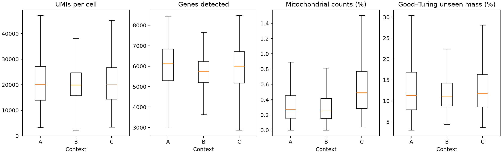
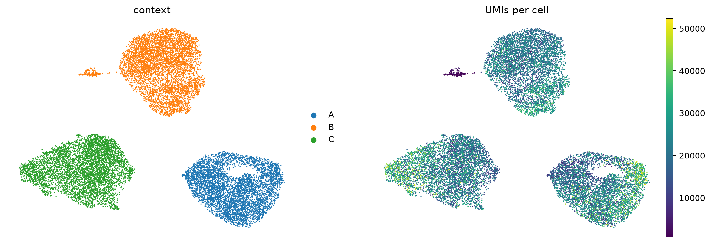
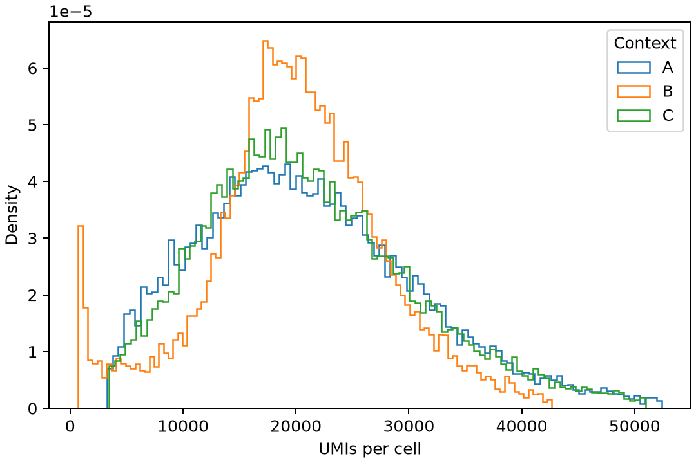
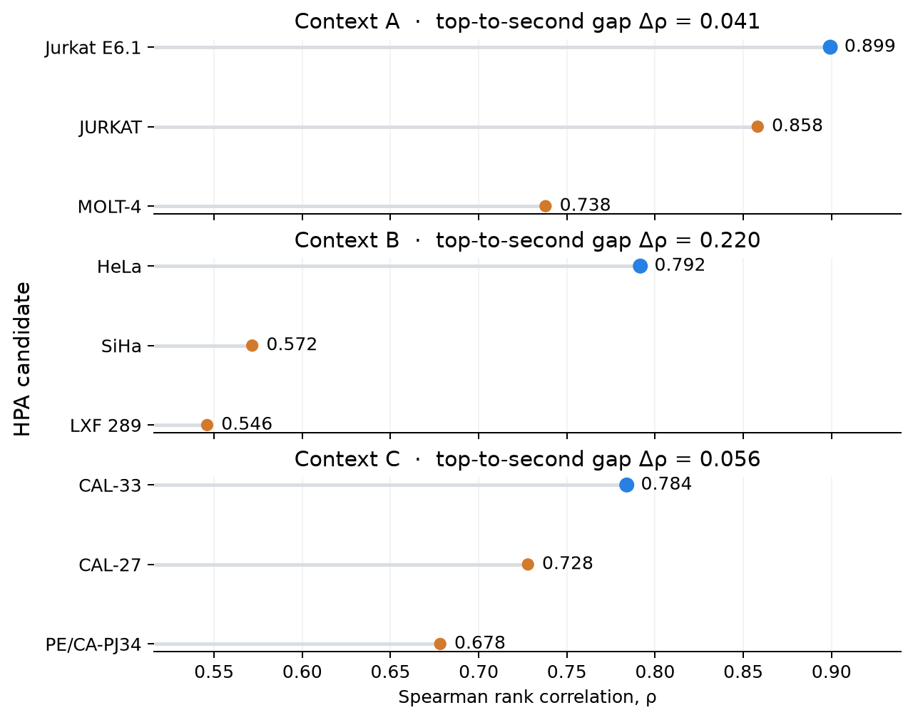

## Summary

- This year's Virtual Cell Challenge is zero-shot CRISPRi perturbation prediction across cell lines. The experimental stack
  is cell-line culture → CRISPRi perturbation → 10x Flex scRNA-seq.
- Continuous cell lines include intrinsically proliferative stem-cell lines (H1 or iPSCs), engineered immortalized
  lines (RPE1 or HEK293), and cancer-derived lines (HeLa).
- Our first guesses for the VCC validation lines are all cancer lines: A → Jurkat E6.1; B → HeLa; C → CAL-33.
- A negative baseline that just sampled the control cells scored −0.304 overall. Five component scores were near zero, but
  DE direction fidelity was strongly negative at −1.721.

## This year's task

This year's Virtual Cell Challenge asks us to predict the responses to 300 different CRISPRi perturbations across three
cell lines, given data on non-targeting (unperturbed) cells in those lines. Instead of just the mean responses
we're asked to predict the distribution of potential response behavior by providing 400 model cells for each perturbation.
When the test week opens, we will be given three new cell lines and will have to supply the same type of predictions.

For the first series of posts, I will unpack the technologies behind this and what they mean for
modeling.

## The data creation stack

> **Cell-line culture** → **CRISPRi perturbation** → **10x Flex scRNA-seq**

In brief, they take a human cell modified to divide continuously, introduce a molecular system that reduces the transcription
of a target gene, and then capture a targeted library of mRNA sequences. In the next three posts, I'm going to go through
each of these stages in more detail to try to understand what considerations they contribute to modeling.

Today I'm going to look at cell lines: what they are, the broad ways they arise, and how those differences might affect
perturbation outcomes.

## The A, B and C control cells

The competition supplies control cells corresponding to 46 non-targeting guides, with 400 cells per guide across three
cell lines. That gives $400 \times 46 \times 3 = 55{,}200$ cells. A quick QC pass confirms the metrics that Arc published:

{#fig-control-qc fig-alt="Four box plots compare UMIs, detected genes, mitochondrial count percentage and Good-Turing unseen mass across contexts A, B and C."}

The only potentially unfamiliar metric is the Good-Turing estimate of unseen mass. If a cell contains (N) total UMIs
and (N_1) genes observed exactly once, then

$$\widehat M_0 = \frac{N_1}{N}.$$

This estimates the probability that another UMI sampled under the same process would belong to a gene not yet observed
in that cell. I'll probably write something more about it sometime soon.

A UMAP over 2,000 highly variable genes shows three distinct clusters. The embedding uses 5,000 cells from each context.

{#fig-control-umap fig-alt="Two UMAP panels show three separated context clusters and their UMI counts. Context B contains a small low-UMI satellite population."}

Interestingly, cell line B has a small satellite population that appears to have far lower UMI counts. We can also see
this more clearly in a plot of the UMI distribution:

{#fig-umi-distribution fig-alt="Density curves of per-cell UMI counts show broadly overlapping distributions and an additional low-count mode for context B."}

The small peak in B is the satellite.

## What is a cell line?

Humans generally do not like parting with their cells. At the same time, researchers need a constantly replenishing source
of consistent cells to experiment with. A continuously dividing population of cells that can be cultured in a dish is
a 'continuous cell line.' (There are also finite cell lines that will not divide continuously but we won't talk about them here.)
Cells from the same line share enough to give researchers a more consistent platform for reproducible experiments (though differences are
still present within a line).

Human cells generally have some ability to divide, but for most cells this is limited.[^hayflick] There are a few ways of getting around this.
How you get around it can be thought of as forming the broad cell line categories:

* You can use a cancer cell. Cancer cells often carry changes that support continued proliferation, making them natural
candidates for continuous cell lines. It was a cervical cancer sample from Henrietta Lacks that
led to the development of the first widely used human cell line, HeLa.[^hela] Cancer cell lines are still widely used and grow robustly,
but that same robustness means they have limited relevance to healthy human cells or even to each other. Over time
separate populations pick up different mutations and chromosomal abnormalities and drift apart.
* You can use a stem cell (or a tissue cell reprogrammed into an induced pluripotent stem cell).[^ipsc] Stem cells are intrinsically proliferative
which means you don't have to break the biology of the cell. The H1 cell line from last year's VCC is a human embryonic stem cell line.[^h1]
* You can take a normal human cell and *immortalize* it by removing its division limits. Every time a cell divides, the
repeated DNA sequences at the ends of its chromosomes—its [telomeres](https://en.wikipedia.org/wiki/Telomere)—shorten
slightly. Introducing [hTERT](https://en.wikipedia.org/wiki/Telomerase_reverse_transcriptase) increases telomerase
activity; telomerase extends the telomeres by adding new repeats. For some cell types that is enough to bypass division limits, while others require additional modifications. RPE1 is an example of an immortalized cell line derived from
retinal pigment epithelial cells.[^rpe1]

Two cells from the same line will have similar genomes (there is always drift with divisions but they will be largely
similar) and similar epigenetic states (things like chromatin conformation and methylation marks are somewhat conserved
in divisions) but they are not perfectly identical.
The longer it has been in use, the more differences we can expect between
cells nominally belonging to that line.
Similarly, differences in growth conditions and the media that the cells are in will also lead to differences between
the state of cells between different labs or experiments.
All of these factors add up to a cell context that determines the response to a perturbation.

## Analysis: what might A, B and C be?

Can we make a guess about what cell line these might be from? The Human Protein Atlas (HPA) provides RNA expression profiles for
1,206 cell lines.[^hpa]
As a simple comparison, for each provided cell line, we use the Spearman rank correlation between the pseudobulked
cell line and the HPA cells to order the HPA cell lines by similarity.

{#fig-hpa-rank fig-alt="Three vertically stacked dot plots show the top three HPA cell-line correlations for contexts A, B and C. HeLa in B has the largest gap over the runner-up."}

Taking the top nomination for each:

| Context | Current hypothesis | Nested classification |
|:---:|---|---|
| A | Jurkat E6.1 | cancer-derived → haematopoietic/lymphoid → T-cell acute lymphoblastic leukaemia |
| B | HeLa | cancer-derived → epithelial → cervical carcinoma |
| C | CAL-33 | cancer-derived → epithelial → squamous → oral/head-and-neck carcinoma |

: {tbl-colwidths="[12,24,64]"}

In an upcoming post, I'll summarize the other datasets that are out there for these lines.

## Submission: the null control-resampling baseline

Our first submission just sets a null expectation: every perturbation has no effect. For each target and
context, I sample 400 cells from that context's controls and relabel them with the target gene (balanced across constructs).

| Metric | Score |
|---|---:|
| Overall | −0.3037 |
| Perturbation discrimination | −0.0050 |
| Expression accuracy | 0.0000 |
| DE log-fold-change accuracy | −0.0053 |
| DE direction fidelity | −1.7214 |
| DE direction reach | −0.0079 |
| DE significance overlap | −0.0826 |

Most components sit close to the zero baseline with direction fidelity the clear exception. In one of my next posts (maybe 3 out),
I will dive into the evaluation metrics to see how they work.

Thanks for reading!

[^hayflick]: Leonard Hayflick and Paul Moorhead described the finite replicative lifespan of cultured human diploid cells in [“The serial cultivation of human diploid cell strains”](https://pubmed.ncbi.nlm.nih.gov/13905658/) (1961), DOI: [10.1016/0014-4827(61)90192-6](https://doi.org/10.1016/0014-4827(61)90192-6).

[^hela]: HeLa was established from cervical cancer cells taken from Henrietta Lacks in 1951 without her knowledge or consent. See the [NIH account of HeLa cells](https://osp.od.nih.gov/hela-cells/) and [Johns Hopkins' account of Henrietta Lacks' legacy](https://www.hopkinsmedicine.org/henrietta-lacks).

[^ipsc]: Kazutoshi Takahashi and colleagues reprogrammed adult human fibroblasts into induced pluripotent stem cells using defined factors: [*Cell* 131, 861–872 (2007)](https://pubmed.ncbi.nlm.nih.gov/18035408/), DOI: [10.1016/j.cell.2007.11.019](https://doi.org/10.1016/j.cell.2007.11.019).

[^h1]: H1 was one of the human embryonic stem-cell lines reported by James Thomson and colleagues in [*Science* 282, 1145–1147 (1998)](https://pubmed.ncbi.nlm.nih.gov/9804556/), DOI: [10.1126/science.282.5391.1145](https://doi.org/10.1126/science.282.5391.1145).

[^rpe1]: ATCC describes [hTERT RPE-1 (CRL-4000)](https://www.atcc.org/products/crl-4000) as a retinal pigment epithelial line immortalized by expression of hTERT.

[^hpa]: [Human Protein Atlas downloadable data](https://www.proteinatlas.org/about/download), version 25.1, accessed 28 August 2026. The cell-line RNA table contains 1,206 profiles over 20,162 genes.
