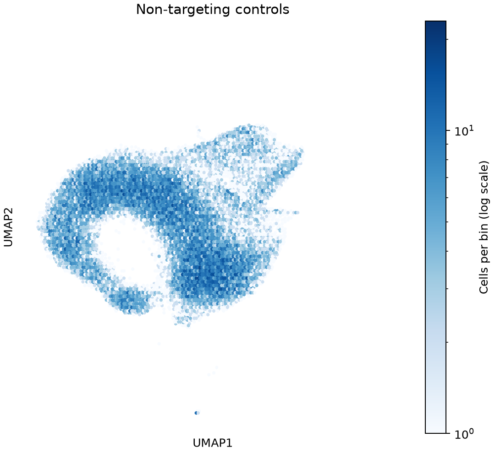
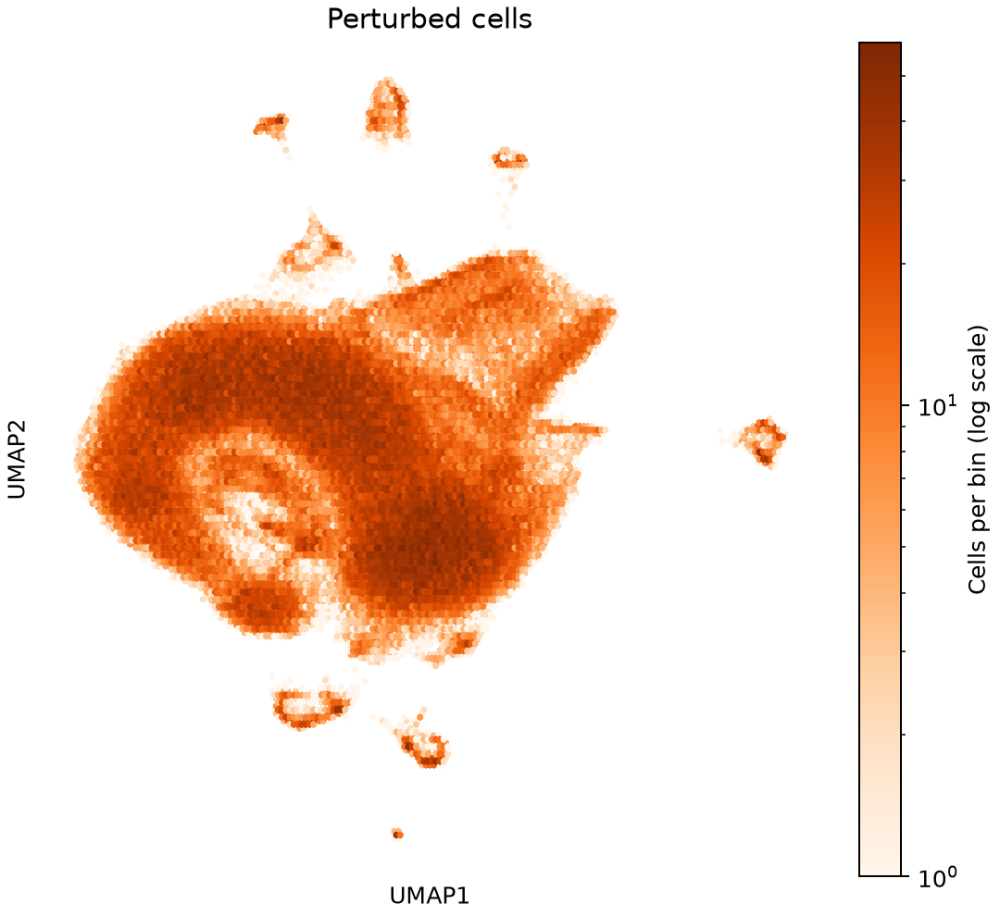
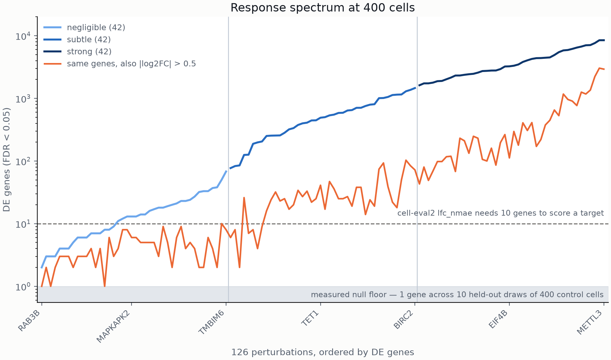
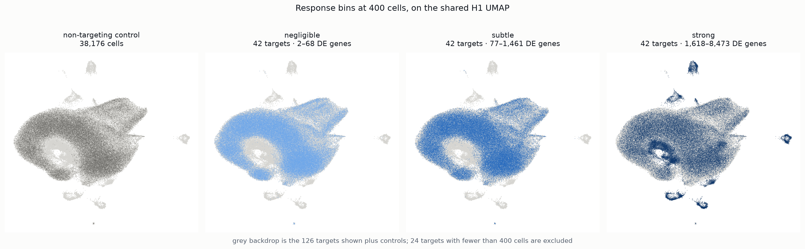
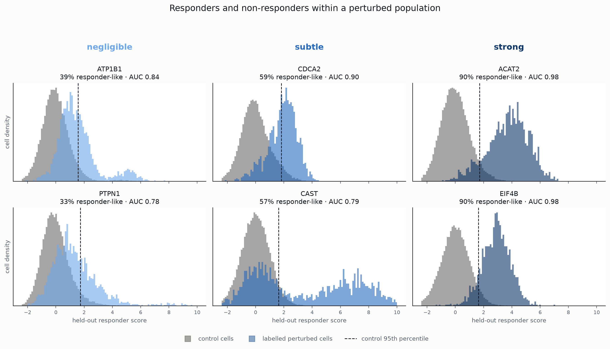
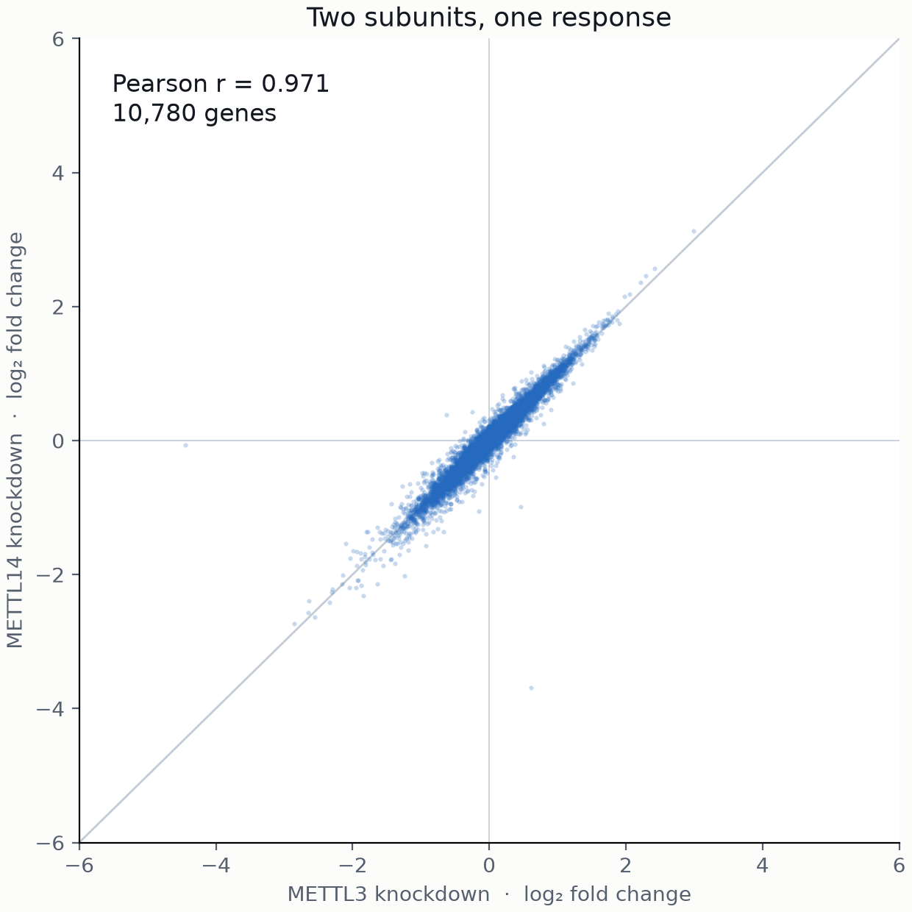

<!-- Central question: What actually happens biologically in a CRISPRi Perturb-seq experiment? -->
Arc has already written a beautiful [post](https://arcinstitute.org/news/behind-the-data-virtual-cell-challenge) covering some of the background material I am talking about.
I encourage a read and I'll try to give a complementary perspective here.

## Why CRISPR interference?

CRISPR associated protein 9 (Cas9) is the central working component of the CRISPR system.
It is essentially a pair of targeted DNA scissors: you give it a guide-RNA that tells it where to cut and it snips the DNA there.
Among many applications, you can use it to knockout genes and study their effects: cutting the DNA along the gene sequence
introduces errors causing proteins to not function and researchers can observe the downstream effects.

There are two problems with this system: cutting the DNA is stressful to the cell which distorts the perturbation, and you cannot
tell if a knockout occurred from the mRNA because the transcripts are still present and very similar to the original sequence.

CRISPRi was developed to address this. First you break the part of Cas9 that cuts DNA but keep the targeting part, Cas9 $\rightarrow$ dCas9.
Then you fuse it to a transcriptional repressor (here they use KRAB) and the resulting dCas9-KRAB system can be
given a target where it will bind and inhibit transcription. The mRNA readout shows the reduced expression directly.

## Running a CRISPRi experiment

Actually making this system work requires a lot more steps:

1. Edit a cell line to express dCas9-KRAB.
2. Develop a lentiviral library of sequences that target your collection of genes.^[[Lentiviruses](https://en.wikipedia.org/wiki/Lentivirus) copy their RNA genomes into the host DNA. By developing a lentiviral population that targets sequences complementary to regions of a gene's transcriptional start site, we can integrate our targeting guide RNAs into the cell line.]
In this experiment each lentivirus contains two guide RNAs that target distinct sites for the target gene.
3. Transduce the lentiviruses into the cell line at low multiplicity of infection (MOI). This means that the dominant number of
lentiviruses received by a cell will be 0 or 1.
4. Select to enrich for transduced cells. By including genes for antibiotic resistance in the lentiviruses, the experimenters can
select for the cells that were perturbed and shift the distribution from majority 0 perturbation cells to majority 1.
5. The cells are then allowed to remodel in response to the perturbation for a time that is experiment specific.
6. Finally the cells are sequenced in a way that also captures the guide RNA sequences. In this case, 10X Flex uses paired probes ($L_g, R_g$)
that both target a particular gene or guide sequence. This includes multiple $L,R$ pairs for each gene in the panel.
This approach has the advantage of letting experimenters target just the mRNA that they want to capture.

Once this has been processed down to count matrices cells can be mapped to perturbation labels by whether a guide construct was detected.
This can involve a considerable amount of QC as ambient guides can lead to higher background levels than we know are present
in the data or cells can receive a guide but not respond to the perturbation or cells can respond to a perturbation but not have
a guide detected. The rest of the post looks at the data from last year's H1 training dataset to see what we can
anticipate in this year's dataset.

## The H1 screen

Arc ran last year's screen in human embryonic stem cells using a wide panel of perturbed genes. After running, the perturbed
genes were binned into three groups by the number of differentially expressed genes:
strong perturbations, subtle perturbations and negligible perturbations. These were sampled to 100 from each group,
using a latent representation of the perturbations^[Arc use ContrastiveVI+, an extension of [ContrastiveVI](https://www.nature.com/articles/s41592-023-01956-2) (Weinberger, Lin & Lee, *Nat. Methods* 2023), which separates perturbation-driven variation from background cell state.] to attempt to capture a diverse range of perturbation effects.
The resulting 300 perturbed genes were again split into groups of size 150 (training), 50 (validation), and 100 (test).

All of that gives us the H1 training set displayed in the UMAPs below. These were calculated on 2000 hvgs using the top 30 PCs.

::: {layout-ncol=2}
{fig-alt="Default H1 UMAP showing non-targeting control cells."}

{fig-alt="Default H1 UMAP showing labelled perturbed cells."}
:::

A few features are immediately clear:

* The NT cells are clustered together in a smeared central mass.
* Well separated constellations of perturbed cells sit around the control cell cluster.
* Many perturbed cells sit with the NT cells.

From this we can expect that the strong perturbations correspond to the well separated clusters, the subtle perturbations
may correspond to some of the less well separated clusters, and the negligible perturbations are integrated in with the NT
controls.

## Differential expression

Besides giving you a way to look at your data, UMAPs don't really tell you anything useful (though if you try to give a presentation
without one people generally revolt).
To look more carefully, I ran differential expression on the perturbed cells following Arc's methodology using their [`cell-eval2`](https://github.com/ArcInstitute/cell-eval2) package: filter genes
to $CPM>5$ in control cells (~18k genes $\rightarrow$ ~10k genes) $\rightarrow$ Mann-Whitney U test $\rightarrow$ Benjamini-Hochberg
at FDR < 0.05 per perturbation.
As a negative baseline, I first checked different sized sets of sampled control cells against the background.

| Group size (cells) | 25 | 50 | 100 | 200 | 400 | 800 | 1600 | 3200 | 4800 |
|---|---:|---:|---:|---:|---:|---:|---:|---:|---:|
| DE calls (per 10 replicates) | 0 | 0 | 0 | 0 | 1 | 0 | 1 | 0 | 0 |

: Held-out random null --- DE calls per 10 replicates.

The FDR<0.05 would predict ~5 genes so the DE tests are well calibrated. The CPM>5 gate is important in making this work. It trims ~8k
genes from the comparison whose low counts make the DE tests very unreliable.^[For a sparse gene, the normal approximation that the Mann-Whitney U test uses badly underestimates the p-value.]
I also ran the check using a held out NT guide against all others. This was less successful. Of the 31 NT guides 15 show DE calls
totaling 221 genes between them. Most of these effects are small and when I put a $|\log_2\mathrm{FC}| > 0.5$ threshold on them we only see 8
NT guides survive with an average of 3 DE genes (max 6).
Off-target activity in some of the guides probably explains these.
The largest effects are all negative and around $\log_2\mathrm{FC} \approx -2$ compared to the perturbations which show knockdowns around $\log_2\mathrm{FC} \approx -4$ for their target genes.

Onto the perturbations. Below I've shown the number of differentially expressed genes across the 126 perturbations with at
least 400 cells. The divisions between negligible, subtle and strong are simple thirds and you shouldn't read too much into them.
The orange line shows the number of DE genes with $|\log_2\mathrm{FC}|$ above 0.5.
{width=75% fig-align="center" fig-alt="Perturbations ordered by the number of DE genes using a 400 cell comparison."}

My first surprise is how many genes move.
In a 10k gene universe, the strongest perturbations like METTL3 perturb about 80% of all genes and nearly 20% with $|\log_2\mathrm{FC}| > 0.5$.
Loosely, we can divide the perturbations into thirds with 1-100 DE genes, 100-1000 DE genes and 1000+ DE genes.
The effect size threshold reduces the number of genes across all groups by around an order of magnitude.

Plotting these groups on the UMAP:

{fig-alt="H1 UMAP with the 126 perturbations (400-cell binning) coloured by negligible, subtle and strong response groups against the controls."}

## Responders and nonresponders across perturbations

Across all perturbations, there are perturbed cells that remain integrated with the control cells.
This implies that among cells that receive the guide construct, there are cells that respond to the perturbation
and those that don't.
To look at this more carefully, I took the DE genes from the differential expression analysis and calculated a per cell
perturbation score:

* Take the top 50 DE genes in order of $|\log_2\mathrm{FC}|$ for each perturbation. Remove the target gene.
* Normalize counts to log1p CPM and for each gene in the set calculate a weight $w_g = \frac{\Delta \mu_g}{\nu_g + \lambda}$ where $\Delta \mu_g$
is the mean difference between perturbed and control cells, $\nu_g$ is a pooled variance and $\lambda$ is a regularization proportional to the median variance gene across genes.
* On a held out collection of cells, calculate a perturbation score per cell $s_c = \sum_g w_g y_{cg}$ for normalized counts $y_{cg}$ and where
the gene sum is over the perturbation gene set. This is the projection along the Fisher linear discriminant.
* Z-score the scores by the control cell score distribution.

The calculation gives:

{fig-alt="Perturbed and control cells scored along the perturbation specific DE gene axis"}

The strong perturbations have
a well separated perturbed population, but the subtle and negligible perturbations are more interesting. ATP1B1, PTPN1 and CAST are
all bimodal with one population integrated with the controls.

The natural interpretation is that we have cells that respond to a perturbation, and cells that do not. The resulting distribution
is a mixture
$$ \pi P_{resp} + (1-\pi)P_{non-resp}.$$
So, are perturbations negligible because the cell response is weak, or because the perturbation system is poor at driving the cell
in that direction?
I think this has more consequences for virtual cell modelling than the field admits. The basic problem is that the
distribution above mixes experimental degrees of freedom (e.g. guide efficiency, sequencing capture, contamination) with biological
degrees of freedom (e.g. silencing and inhomogeneous cell state). Learning both of those simultaneously asks a lot of a learning
algorithm, especially when experimental features are not going to generalize.

I can think of a few approaches to address this.
First, there are tools like Mixscape that reclassify cells as responders and non-responders based on their transcriptional state. That at least
reduces the false positive problem in the data. People who publish datasets are not strongly incentivized to use them because they
lower the cell numbers per perturbation, but they can be a simple first guard.
More interestingly, we can look at approaches that separate experimental and biological degrees of freedom explicitly. Most
approaches I have seen try to have the learning algorithm discard these degrees of freedom, but I think to create useful generative
models we will have to treat them more carefully.

## Looking at the Biology

[Systema](https://www.nature.com/articles/s41587-025-02777-8) noted that many perturbation experiments have a strong shared signal amongst perturbations and a
shared signal would be a simple way to exceed the control baseline in the virtual cell scoring.
Viñas Torné et al. define the systematic variation as the average cosine similarity across perturbations between the
perturbation shift from controls and the average effect of all perturbations (essentially how aligned perturbations are in a single direction).
Calculating that here actually shows that the H1 dataset has the lowest systematic variation of any of the datasets in the paper.

| dataset | systematic variation |
|---|---:|
| VCC 2025 H1 (this screen) | 0.187 |
| Replogle K562 (Systema's lowest CRISPRi) | 0.32 |
| Norman | 0.50 |
| Adamson | 0.76 |
| Systema, mean over ten datasets | 0.41 |

: Systematic variation --- mean cos(perturbation shift, average effect).

The comparison is not fair: This dataset is a group of perturbations selected to represent diverse
outcomes, so this is more a testament to Arc's preprocessing than the screen itself.

To see what this direction is, I used the perturbation scores from the previous section pooled across perturbations
and ran a LASSO regression to pick out the genes that covaried with perturbation overall.
The top genes are to be expected:

| direction | genes | program |
|---|---|---|
| down in responders | ZFP42/REX1, L1TD1, DNMT3B | core pluripotency |
| down in responders | HMGCR, SCD, SLC38A5, EIF4A2, MCM5 | sterol/lipid synthesis, amino-acid transport, translation, replication |
| up in responders | LEFTY2, MDK | differentiation |

: Shared responder signature.

The top genes correspond to a loss of pluripotency, downregulation of proliferation and differentiation. Expanding the gene set to
200 genes, this direction captures 40% of the variance in the perturbation score on held-out cells. To go much further, we need to start looking at individual biology.

## A Potentially Useful Pattern

Hybridizing proteins have similar perturbations. METTL3 and METTL14 are obligate heterodimers meaning they are two
different proteins that must be bound together to function. We would expect that knocking down either would give similar results and that
is exactly what we see:

{width=55% fig-align="center" fig-alt="Scatter of METTL3 versus METTL14 log2 fold changes; they correlate at 0.971, the highest of any perturbation pair, with 100% sign agreement."}

They are methyltransferases (they transfer methyl groups onto mRNA) that regulate mRNA stability, splicing and translation, which is also why they have such widespread effects.
This pattern of similarity amongst complexes holds more widely, though to a lesser extent.

## A Local Scoring Benchmark

To speed up our iterations, we can use Arc 2025 as a scoring benchmark to test and iterate before we submit to the
actual competition. I had ChatGPT build a harness that uses Arc's `cell-eval2` on a precomputed DE gene panel across
the perturbation dataset, and a minimal set of data artifacts^[I'm uncertain about whether I can distribute Arc derived data
so I decided to include a setup function that downloads the dataset and makes the artifacts. A bit heavier but you only need
to run it once]. The panel is the
126 H1 targets with at least 400 cells against the 38,176 non-targeting cells. It is available [here](https://github.com/forrestsheldon/vcc2026-h1-benchmark).
I probably haven't tested it sufficiently so please use at your own risk.

To do that, I've submitted a control baseline AND the control cell baseline shifted by the global perturbation axis (the average shift from the control cells to the perturbed cells)

| metric | unchanged control | control + global axis |
|---|---:|---:|
| PDS (discrimination) | −0.046 | −0.045 |
| expr MSE (capped, norm) | 0.000 | 0.000 |
| DE log2FC nMAE | −0.076 | −0.069 |
| DE direction fidelity | −0.084 | **+0.069** |
| DE direction reach | −0.061 | −0.047 |
| DE significant-gene Jaccard | −0.005 | +0.004 |
| **avg_score** | **−0.045** | **−0.015** |

The H1 control baseline (−0.045) sits well above the [2026 control baseline](../2026-08-29-exploring-the-data-i/index.qmd) (around −0.3), mostly because
its direction fidelity (−0.084) stays far closer to zero than the −1.7 on the 2026 panel.
Using this harness you can evaluate both how your model might perform as well as what specific perturbations it is succeeding or failing
on for each metric. I'll probably add some diagnostic/visualisation tools to it as well over the next few weeks.

## Shifting this year's controls

I ran the same experiment on this year's data, shifting the control cell profiles by the fixed global axis from the 2025 data.

| metric | 2026 shifted control |
|---|---:|
| overall | −0.088 |
| PDS (discrimination) | +0.002 |
| expression MSE | 0 |
| DE log2FC nMAE | −0.606 |
| DE direction fidelity | −0.042 |
| DE direction reach | +0.122 |
| DE significance Jaccard | −0.005 |

: 2026 validation submission --- controls shifted by the H1 global axis.

Almost the entire gain is in direction fidelity, which climbs
from around `−1.7` to `−0.04`: shifting by the global axis improves the sign agreement of many genes.
 Discrimination (PDS) does not move, because every target receives the same shift. However, the gain is much
 larger here than the `+0.031` measured on H1. If anyone understands why the shifts are so different let me know!
