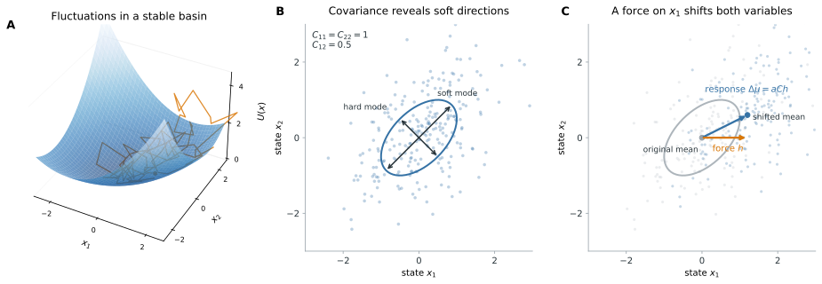
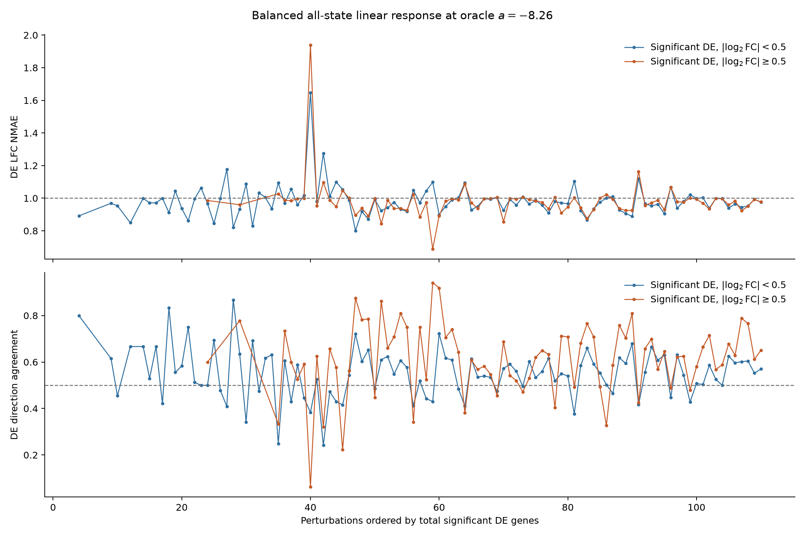

To start with a zero-shot baseline, we need a model that can be trained purely on data from a cell context.
Linear response models are a perfect candidate. The idea is that by watching a system fluctuate around its stable state, we
learn about the system's allowed behavior. In this post, I'll cover the basics of linear response theory, then we will look
at several variants applied to this year's VCC data.

## An Intuitive Approach to Linear Response

Suppose we have a system moving around a stable state. Close to this state, the system obeys a local model that is some
quadratic basin.
If we watch the system fluctuate, whether due to its dynamics or due to noise, we get a point cloud whose
shape approximates this basin.
The covariance of our measurements gives us information about the restoring forces the system feels:
directions that the system varies widely in are 'soft modes' with low restoring forces, while narrow directions are 'hard modes'
with strong restoring forces.
So, we expect that the covariance is inversely proportional to the 'force'.

{#fig-linear-response-intuition fig-alt="Three panels illustrate linear response. A trajectory fluctuates in an elongated quadratic basin. Its two-dimensional point cloud has covariance matrix with unit variances and covariance 0.5, with wide soft and narrow hard axes. Finally, a horizontal force along x1 shifts the mean diagonally because the variables are correlated."}

In equations, for an equilibrium system with quadratic restoring force $-Kx$ and isotropic fluctuations, the covariance $C$
obeys
$$K \propto C^{-1}.$$
In particular, if we push on the system with force vector $h$, then the system will move to the new state,
$$0 = -Kx + h \quad\Longrightarrow\quad x = K^{-1}h \quad\Longrightarrow\quad x \approx aCh$$
where $a$ is some constant of proportionality. This is the linear response: pushing on a single gene $g$ gives us a response
proportional to $C_{:g}$, the $g$th column of the covariance matrix. The constant of proportionality can be set by tuning on a
validation set. The application of this idea to perturbation prediction follows CIPHER, which models transcriptome-wide responses as linear
readouts of control-cell covariance.^[Benjamin Kuznets-Speck, Leon Schwartz, Hanxiao Sun, Madeline E. Melzer, Nitu Kumari,
Benjamin Haley, Ekta Prashnani, Suriyanarayanan Vaikuntanathan and Yogesh Goyal (2025), "Fluctuation structure predicts
genome-wide perturbation outcomes," *bioRxiv*. <https://doi.org/10.1101/2025.06.27.661814>]

This forms a perfect baseline method for zero-shot perturbation inference: it takes into account cell context by fitting a
different covariance for each cell line and does not require any perturbation data to train. Of course, we expect the
results to be correspondingly poor, but it gives us something interpretable to build off of.
For the rest of this post, I'll look at how well this works and variations that get us closer to the statistics of real data.

## Vanilla Linear Response

For counts $Y_{cg}$ in cell $c$ and gene $g$ we normalize to $L_{cg} = \log\!\left(1 + \kappa \frac{Y_{cg}}{\sum_j Y_{cj}}\right)$ where
$\kappa=10^4$ is a scaling factor that corrects for differences in depth. The $\operatorname{log1p}$ brings genes that
are expressed at very different levels to a comparable scale and adds a pseudocount to deal with zeros.
For linear response, we calculate the covariance
$$C_{gh} = \mathbb{E}[L_{cg}L_{ch}] - \mathbb{E}[L_{cg}]\,\mathbb{E}[L_{ch}]$$
where the expectations are taken over the ensemble of cells.
We can connect this normalization to our measurement model in the last post. In the first appendix, we show that for
counts distributed as
$$Y_{cg} \sim \operatorname{Poisson}\!\left(s_c e^{X_{cg}}\right)$$
which connects to our measurement model as $e^{X_{cg}} = f_g \pi_{cg}$. Under the Poisson-lognormal approximation
$X_c \sim \mathcal{N}(\mu, \Sigma)$, define $m_g = \mathbb{E}[e^{X_{cg}}]$. The covariance then has two regimes:

* For high count genes, the normalized covariance $\operatorname{Cov}(L_{cg}, L_{ch})$ approaches the Poisson-lognormal covariance $\operatorname{Cov}(X_{cg}, X_{ch})$.
* For distinct low-count genes, the normalized covariance is scaled by the product of their mean expression values:
$\operatorname{Cov}(L_{cg}, L_{ch}) \approx \kappa^2 m_g m_h (e^{\Sigma_{gh}}-1) \approx \kappa^2 m_g m_h \Sigma_{gh}$, where the second approximation requires small $\Sigma_{gh}$. This can mean that the $\operatorname{log1p}$ covariance is less susceptible to low-count noise than the direct latent estimator.

Rather than jumping straight to a submission, I want to spend some time looking at the results in last year's H1 screen.

### Control Cell Linear Response

To start, I calculated the covariance columns for each target gene $t$, $C_{:t}$.
To pick the scaling factor, I split the H1 perturbations into two halves. In each direction, I selected $a$ by minimizing
the mean DE-LFC NMAE over perturbations with at least ten significant downstream DE genes in one half and evaluated it
on the other.

| Calibration half | Selected $a$ | Held-out DE-LFC NMAE |
|---|---:|---:|
| Half 1 | $-7.16$ | 1.0116 |
| Half 2 | $0$ | 1.0000 |
| Pooled cross-fitted result | -- | 1.0057 |

: The unchanged prediction has NMAE 1. Each held-out half is evaluated at the scale selected on the other half. {#tbl-vanilla-lr-scale-crossfit}

We found no nonzero global scale that transferred across perturbations. One calibration fold selected $a=-7.16$, but this worsened held-out NMAE; the other selected $a=0$.

I was a bit shocked by this. I expected covariance to perform poorly, but not to be indistinguishable from controls.
The assumptions of linear response theory are so general that I expect at least some improvement.
But to quote HJPEV (loosely) "Your strength as a rationalist is your ability to be more shocked by fiction than reality."
Being shocked by a result means that you are misunderstanding something, so let's start breaking this down.

### Breaking Down the Metrics

Before anything else, we need to confirm that we are estimating the covariance reliably. If our
estimation is dominated by noise, that is a simple explanation for why the results are garbage.
Splitting the cells in half and estimating the covariance in each, the median cosine similarity between
columns is 0.93 so we are getting a reliable estimate.

Next we ask whether there are any regimes, across perturbations and response genes where linear response is working.
We might expect that for weak perturbations, linear response does work, but for strong perturbations we are escaping
the local stable state and not getting a useful response.
For this I set the scaling constant to $a=-10$ which is on par with the median of $\Delta L_{tt}/C_{tt}$ across the perturbations.
Below I've plotted the DE NMAE and direction agreement across perturbations for weakly and strongly perturbed genes.

{#fig-fixed-a-minus10-nmae}

The results are not dramatic but weakly support what we expect. The perturbations with the fewest and weakest significant DE
genes are maybe slightly improved by linear response. In all, the control state covariance does not give much useful information
on perturbation.

## Oracle Linear Response

What would we have to do to rescue linear response?
A reasonable guess would be that our dataset needs to include the variation that we are asking it to fit.
It may be that the variation in the control cells is driven by systematic effects in our sampling noise which, while
consistent enough to pass the split half cosine evaluation, do not give us useful biological information.
We can ensure the information that we need is in our dataset by using a balanced sample of the perturbation data.
This is now zero-shot in the sense that the perturbations are blinded, but we are at least assured that
our training dataset includes the information we want it to learn.
The results of applying linear response to the perturbation dataset itself are below:
Since this is already an oracle calculation, I gave each covariance one global scaling constant selected to minimize
the mean NMAE over all significant DE genes. The weak and strong gene classes were evaluated only after selecting this scale.

| Covariance | DE gene group | Eligible perturbations | DE-LFC NMAE | DE direction agreement |
|---|---|---:|---:|---:|
| Control only | All significant DE | 110 | 0.9998 | 0.5148 |
| Balanced all-state | All significant DE | 110 | 0.9834 | 0.5663 |
| Control only | Significant DE, $\lvert\log_2\mathrm{FC}\rvert<0.5$ | 101 | 0.9989 | 0.5155 |
| Balanced all-state | Significant DE, $\lvert\log_2\mathrm{FC}\rvert<0.5$ | 101 | 0.9823 | 0.5530 |
| Control only | Significant DE, $\lvert\log_2\mathrm{FC}\rvert\geq0.5$ | 78 | 1.0010 | 0.5000 |
| Balanced all-state | Significant DE, $\lvert\log_2\mathrm{FC}\rvert\geq0.5$ | 78 | 0.9814 | 0.6132 |

: Expected-profile metrics at each covariance's globally optimized oracle scale. An unchanged prediction has NMAE 1; chance direction agreement is 0.5. {#tbl-balanced-all-state-de-nmae}

{#fig-balanced-all-state-de-nmae}

We see a consistent, but very subtle improvement in both the NMAE and the direction agreement across the perturbations.
The improvement in direction is strongest among the strong DE genes, as we would expect because they will influence the
covariance the most.
So, including the needed variation in the dataset does improve the response estimates, but by far less than
we might guess. Why?

## Signal Dilution in Covariance

The issue with this approach is very simple: The covariance is an expectation over cells and each perturbation state
forms only a portion of that expectation. The signal from any individual response is diluted across the many responses.
Let $P_c \in \mathcal{P}$ denote the perturbation condition of cell $c$, with $M=\lvert\mathcal{P}\rvert$ equally weighted conditions.
By the law of total covariance,
$$C_{gh} = \mathbb{E}_{P_c}\!\left[\operatorname{Cov}(L_{cg}, L_{ch} \mid P_c)\right] + \operatorname{Cov}_{P_c}\!\left(\mathbb{E}[L_{cg} \mid P_c], \mathbb{E}[L_{ch} \mid P_c]\right).$$
The first term is the average covariance within each state: the fluctuation around the mean expression, averaged
over perturbation states. The second is the term that hides the perturbation response, the covariance between the mean expression
across the different perturbation states. With $L_c=(L_{cg})_g$, define
$$\ell^{(p)} = \mathbb{E}[L_c \mid P_c=p], \qquad \bar{\ell} = \frac{1}{M}\sum_{p\in\mathcal{P}}\ell^{(p)}.$$
The usual finite-state sample estimator of the second term is
$$\widehat{C}^{\mathrm{between}} = \frac{1}{M-1}\sum_{p\in\mathcal{P}}\left(\ell^{(p)}-\bar{\ell}\right)\left(\ell^{(p)}-\bar{\ell}\right)^{\mathsf{T}}.$$
The column corresponding to the perturbation response for target $t$ is
$$\widehat{C}^{\mathrm{between}}_{:t} = \frac{1}{M-1}\sum_{p\in\mathcal{P}}\left(\ell^{(p)}-\bar{\ell}\right)\left(\ell_t^{(p)}-\bar{\ell}_t\right).$$
The rightmost scalar can be viewed as a weight: this is a sum over all perturbation-state mean vectors, weighted
by how much each state changes the target gene relative to its across-state mean.
The largest change may be in the knockdown itself, but all other perturbations contribute.
Then, adding the average covariance across states further dilutes the perturbation signal.
(We can also write this in terms of the perturbation shift from the control state, rather than
the average perturbation state, but the argument is the same.)

We can see this directly by looking at the alignment of the target covariance column with the true perturbation response
in each of the two terms.

| Covariance component | Mean cosine with true response |
|---|---:|
| Within-state | 0.00 |
| Between-state | **0.24** |
| Total | 0.06 |

: Target-excluded cosine in $\operatorname{log1p}$-CP10K space. The target state is included, so this diagnoses signal dilution rather than predictive generalization. {#tbl-covariance-dilution}

The between-state term that carries the perturbation response contributes only 5.8% of the total target variance and so
its contribution to the total covariance is diluted away.

## Where to Next

Linear response pretty resoundingly fails to give us useful information about the cell's response to perturbations. That is not a huge
surprise as many of its assumptions are violated by the observations we have and so we are applying it well out of its
realm of applicability. The perturbations are not small changes around a stable state and our observations are not due
to isotropic noise filtered through the cell dynamics.

What interests me going forward is that including the perturbed cells also failed (there was a small improvement but
not nearly as much as I would guess). Learning a quadratic representation of
the perturbation data failed to recapitulate the perturbations because of the dilution argument above.
Whatever representation we try to learn needs to have some way of
separating relevant cells from the irrelevant, whether by conditioning on target expression or by using regression on
other perturbation datasets. Training on a blinded perturbation dataset forms a useful easier subproblem for getting a zero-shot
approach to work and I might use that on subsequent attempts.

## Appendix 1: Measurement Model and Log-Normalized Moments

Beginning with the measurement model we absorb $f_g \pi_{cg} = e^{X_{cg}}$ as for a single experiment we cannot separate
the gene sensitivities $f_g$. Beginning with the count model
$$Y_{cg} \sim \operatorname{Poisson}\!\left(s_c e^{X_{cg}}\right)$$
we form the transformed counts
$$L_{cg} = \log\!\left(1 + \kappa \frac{Y_{cg}}{s_c}\right).$$

In the high count limit, $\kappa \frac{Y_{cg}}{s_c} \gg 1$ we have
$$L_{cg} \approx \log\!\left(\kappa \frac{Y_{cg}}{s_c}\right) = \log \kappa + \log\!\left(\frac{Y_{cg}}{s_c}\right) \approx \log \kappa + X_{cg},$$
so $\operatorname{Cov}(L_{cg}, L_{ch}) \approx \operatorname{Cov}(X_{cg}, X_{ch})$.

In the low count limit, $\operatorname{log1p}(x) \approx x$
$$L_{cg} \approx \kappa \frac{Y_{cg}}{s_c}, \qquad \mathbb{E}[L_{cg} \mid X_{cg},s_c] \approx \kappa e^{X_{cg}}.$$
Assume $X_c \sim \mathcal{N}(\mu, \Sigma)$ and define the expected per-gene Poisson rate
$m_g = \mathbb{E}[e^{X_{cg}}] = e^{\mu_g + \frac{1}{2}\Sigma_{gg}}$.
Under conditional independence of the Poisson counts, the low-count covariance between distinct genes is
$$\operatorname{Cov}(L_{cg}, L_{ch}) \approx \kappa^2 \operatorname{Cov}(e^{X_{cg}}, e^{X_{ch}}) = \kappa^2 m_g m_h \left(e^{\Sigma_{gh}} - 1\right).$$
For small $\Sigma_{gh}$ we have,
$$\operatorname{Cov}(L_{cg}, L_{ch}) \approx \kappa^2 m_g m_h \Sigma_{gh}.$$
On the diagonal, Poisson sampling contributes an additional term:
$$\operatorname{Var}(L_{cg}) \approx \kappa^2\operatorname{Var}(e^{X_{cg}}) + \kappa^2\mathbb{E}\!\left[\frac{e^{X_{cg}}}{s_c}\right].$$

So, for high count genes our usual $\operatorname{log1p}$-CP10K covariance will approach that of the Poisson log-rate.
For low count genes, the off-diagonal covariance is suppressed by the product of the mean rates.
To actually use this, we approximate the size factor with the total counts, which means the Poisson rate $e^{X_{cg}}$
is the proportion of total counts. This means a multinomial sampling model is a little closer to what we are imposing
rather than independent Poisson, but the two are closely related.
